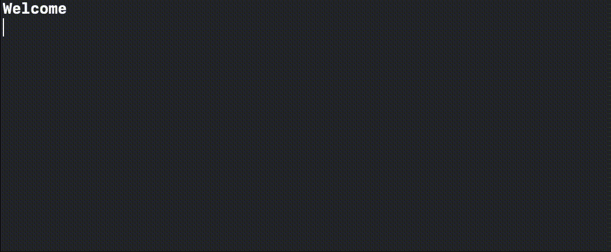

# Narratore

`Narratore` is a Swift library that can be used to create and run interactive stories and narrative games.

With `Narratore` you can create stories using a DSL that allows to focus on the narration, with very few lines of code. In `Narratore` __a story is a Swift Package__.

The library also makes it easy to run a story, with a callback-based handler.

Here's a taste of a minimal definition for a game with `Narratore`:

```swift
import Narratore

// ------ Define a game setting ------ //

enum MyGame: Setting {
  enum Generate: Generating {
    static func randomRatio() -> Double {
      Double((0...1000).randomElement()!)/1000
    }
    
    static func uniqueString() -> String {
      UUID().uuidString
    }
  }
  
  struct Message: Messaging {
    var id: String?
    var text: String

    init(id: ID?, text: String) {
      self.id = id
      self.text = text
    }
  }

  struct Tag: Tagging {
    var value: String
    
    init(_ value: String) {
      self.value = value
    }
  }
  
  struct World: Codable {
    var isEnjoyable = true
  }
}

// ------ Write a story ------ //

extension MyGame: Story {
  static let scenes: [RawScene<MyGame>] = [
    MyFirstScene.raw,
    MySecondScene.raw,
  ]
}

struct MyFirstScene: Scene {
  typealias Game = MyGame
  
  static let branches: [RawBranch<MyGame>] = [
    Main.raw,
  ]
  
  enum Main: Branch {
    typealias Anchor = String

    @BranchBuilder<Self>
    static func getSteps(for _: MyFirstScene) -> [BranchStep<Self>] {
      "Welcome"
      
      "This is your new game, built with narratore".with(tags: [.init("Let's play some sound effect!")])
      
      check {
        if $0.world.isEnjoyable {
          "Enjoy!"
        }
      }
      
      "Now choose".with(anchor: "We could jump right here from anywhere")
      
      choose { _ in
        "Go to second scene, main path".onSelect {
          "Let's go to the second scene!"
            .with(id: "We can keep track of this message")
            .then(.transitionTo(MySecondScene.init(magicNumber: 42)))
        }

        "Go to second scene, alternate path".onSelect {
          "Going to the alternate path of the second scene"
            .then(.transitionTo(MySecondScene.Other.self, scene: .init(magicNumber: 43)))
        }
      }
    }
  }
}

struct MySecondScene: Scene {
  typealias Game = MyGame
  
  var magicNumber: Int
  
  static let branches: [RawBranch<MyGame>] = [
    Main.raw,
    Other.raw,
  ]
  
  enum Main: Branch {
    @BranchBuilder<Self>
    static func getSteps(for scene: MySecondScene) -> [BranchStep<Self>] {
      "Welcome to the second scene"
      
      if scene.magicNumber == 42 {
        "The magic number is \(scene.magicNumber)"
      } else {
        "The magic number doesn't look right..."
      }
      
      "Hope you'll find this useful!"
    }
  }
  
  enum Other: Branch {
    @BranchBuilder<Self>
    static func getSteps(for scene: MySecondScene) -> [BranchStep<Self>] {
      "I see you chose the alternate path"
      
      "Bad luck!"
    }
  }
}

// ------ Run the game ------ //

final class MyHandler: Handler {
  typealias Game = MyGame

  func handle(event: Event<MyGame>) {
    if case .gameEnded = event {
      print("Thanks for playing!")
    }
  }
  
  func acknowledge(narration: Narration<MyGame>) async -> Next<MyGame, Void> {
    for message in narration.messages {
      print(message)
      _ = readLine()
    }
    return .advance
  }
  
  func make(choice: Choice<MyGame>) async -> Next<MyGame, Option<MyGame>> {
    for (index, option) in choice.options.enumerated() {
      print(index, option.message)
    }
    
    while true {
      guard
        let captured = readLine(),
        let selected = Int(captured),
        choice.options.indices.contains(selected)
      else {
        print("Invalid input")
        continue
      }
      
      return .advance(with: choice.options[selected])
    }
  }
}

@main
enum Main {
  static func main() async {
    await Runner<MyGame>.init(
      handler: MyHandler.init(),
      status: .init(
        world: .init(),
        scene: MyFirstScene.init()
      )
    ).start()
  }
}
```



To learn about the detail of each main component of `Narratore`, check the following docs:

- [Defining a game setting](Docs/DEFINING_A_GAME_SETTING.md)
- [Writing a story](Docs/WRITING_A_STORY.md)
- [Running the game](Docs/RUNNING_THE_GAME.md)

`Narratore` is designed to be modular and extensible. In fact, each main component can be defined and implemented in a separate Swift package. For example:

- a specific game setting could be defined in a library;
- several stories could be created for a certain game setting;
- a game handler for that setting could be created for each platform (command line, iOS, macOS, Linux...);
- the final game would mix the game handler with one or more stories.

To learn how to extend `Narratore` and define modular components, check out [Extending Narratore](Docs/EXTENDING_NARRATORE.md).

The linked docs progressively build a basic game setting, a short story, a simple command-line runner, and some extension, each of which can be found in a companion package called [SimpleGame](https://github.com/broomburgo/SimpleGame), whose purpose is to show the basics of `Narratore` in practice via the construction of an actual story that can be run from the command line.

The main purpose of the companion package is to document the features of `Narratore`; nevertheless, most of its code is generic and reusable, and can be used to create games: please refer to the companion package [README](https://github.com/broomburgo/SimpleGame) to learn how to use it in your projects.

Thanks for checking out `Narratore`, I hope you'll have fun with it!

## Requirements

`Narratore` requires `iOS 13` and `macOS 10.15`, and has no third-party dependencies.

## Acknowledgments

`Narratore` was heavily inspired by [Ink](https://www.inklestudios.com/ink/), and its initial purpose was to be a similar story creation engine, but with the possibility of defining stories in Swift, instead of using a markup language. Nevertheless, the Ink specification was a strong inspiration for the features of `Narratore`.
